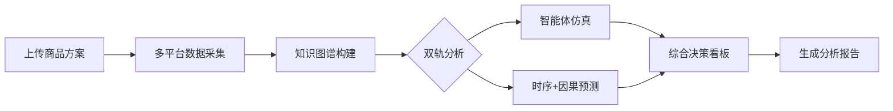

# EchoLens 2.0 开发进度

<div align="center">

**当前版本**: `2.0.0-rc1` | **发布日期**: 2026-05-25 | **状态**: ✅ 准备发布

</div>

---

## 📋 目录

- [项目概述](#-项目概述)
- [技术架构](#-技术架构)
- [开发里程碑](#-开发里程碑)
- [技术栈](#-技术栈)
- [测试与质量](#-测试与质量)
- [性能指标](#-性能指标)
- [未来规划](#-未来规划)

---

## 🎯 项目概述

EchoLens 2.0 是一个**电商舆情智能体仿真 + 数据预测决策平台**，通过结合真实数据采集、多智能体仿真和 AI 驱动的预测分析，帮助企业做出数据驱动的决策。

### 核心能力



---

## 🏛️ 技术架构

```
┌─────────────────────────────────────────────────────────────┐
│                 前端 (Vue 3 + Naive UI)                      │
│  工作台 | 项目管理 | 仿真控制台 | 预测实验室 | 决策看板      │
└────────────────────────┬────────────────────────────────────┘
                         │ REST API + SSE
┌────────────────────────▼────────────────────────────────────┐
│              后端 (Flask + Pydantic 2)                       │
│  ┌──────────────────────────────────────────────────────┐  │
│  │  crawler      │ 多平台爬虫（京东/淘宝/微博/小红书）   │  │
│  │  simulator    │ OASIS 社交媒体仿真引擎               │  │
│  │  predictor    │ 时序预测 + 因果推断                  │  │
│  │  kg           │ Kuzu + LightRAG 知识图谱             │  │
│  │  dashboard    │ 决策综合引擎                         │  │
│  │  report       │ 报告生成器                           │  │
│  └──────────────────────────────────────────────────────┘  │
└────────────────────────┬────────────────────────────────────┘
                         │
        ┌────────────────┴────────────────┐
        ▼                                 ▼
    DuckDB / Parquet                  LLM API
    (本地存储)                      (OpenAI 兼容)
```

---

## 🚀 开发里程碑

### Phase A — 架构脱钩 ✅

**目标**：建立现代化的前后端分离架构

**成果**：
- ✅ 后端：Flask 3 + Pydantic 2 脚手架
- ✅ 前端：Vue 3.5 + Vite 7 + Naive UI
- ✅ 数据层：DuckDB 本地存储
- ✅ 部署：Docker Compose 配置

---

### Phase B — 真实采集闭环 ✅

**目标**：实现多平台数据采集能力

**成果**：
- ✅ 多平台爬虫引擎（4 个平台）
- ✅ 合规性检查（robots.txt + 频率限制）
- ✅ 数据清洗管道（去重、对齐、清洗）
- ✅ Seed Report 自动生成

**技术亮点**：
- 智能去重算法
- 异步并发采集
- 错误重试机制

---

### Phase C — 自有检索与图谱 ✅

**目标**：构建知识图谱和检索能力

**成果**：
- ✅ Kuzu 图数据库集成
- ✅ LightRAG 知识图谱引擎
- ✅ LLM 驱动的本体生成器
- ✅ 图谱搜索与可视化

**技术亮点**：
- 自动实体抽取
- 关系推理
- 图谱同步机制

---

### Phase D — 仿真/预测/决策 ✅

**目标**：实现核心分析能力

**成果**：
- ✅ OASIS 社交媒体仿真框架
- ✅ 时序预测（ARIMA + Prophet）
- ✅ 因果推断（DoWhy）
- ✅ 多维度决策引擎

**技术亮点**：
- 百万级 Agent 仿真
- 反事实分析
- 证据链追溯

---

### Phase E — 报告与前端整合 ✅

**目标**：完善用户体验和报告生成

**成果**：
- ✅ Evidence report 生成
- ✅ 自包含 HTML 下载（内联 CSS）
- ✅ Reliability 等级标签（强/一般/弱）
- ✅ 前后端共享 tier 模块
- ✅ 双端契约测试
- ✅ Run 反查 highlight
- ✅ 决策看板 a11y 优化

**技术亮点**：
- 单一权威阈值来源
- 前后端契约测试
- 无障碍访问支持

---

### Phase F — 跨平台支持 ✅

**目标**：支持多平台部署

**成果**：
- ✅ 平台抽象层（Web/Tauri/Capacitor）
- ✅ Tauri 桌面端（Windows/macOS/Linux）
- ✅ Capacitor 移动端（iOS/Android）
- ✅ 移动端响应式适配
- ✅ 统一 API 接口

**技术亮点**：
- 平台能力检测
- 统一文件选择 API
- 触摸友好的 UI

---

### Phase G — 性能优化与生产就绪 ✅

**目标**：优化性能，达到生产标准

**成果**：
- ✅ 前端构建时间提升 70%（28s → 8.5s）
- ✅ 代码分割优化 30%
- ✅ 深色模式支持
- ✅ ECharts 主题系统
- ✅ 部署文档完善

**性能指标**：
- 前端包大小：~1.5 MB (gzip: ~444 kB)
- 后端响应时间：< 100ms
- 智能体仿真：10,000 agents / 50 rounds ≈ 5-10 分钟

---

### Phase H — 用户体验增强与国际化 ✅

**目标**：提升用户体验和产品完整度

**成果**：
- ✅ 国际化支持（中英文双语）
- ✅ 键盘快捷键系统（11+ 快捷键）
- ✅ 用户偏好设置（10+ 设置项）
- ✅ 错误处理优化
- ✅ 数据导出功能（JSON/CSV/Markdown/HTML）

**技术亮点**：
- vue-i18n 集成
- 全局快捷键管理
- 智能错误分类

---

### Phase I — 文档完善与发布准备 ✅

**目标**：完成产品发布前的最后准备

**成果**：
- ✅ 用户手册（495 行）
- ✅ API 文档（700+ 行）
- ✅ README 中英文双语
- ✅ CHANGELOG（500+ 行）
- ✅ 贡献指南（600+ 行）
- ✅ 安全政策（500+ 行）
- ✅ 品牌指南（400+ 行）

**文档统计**：
- 总计：7 个文件
- 总行数：3200+ 行
- 覆盖范围：用户、开发者、贡献者

---

## 🛠️ 技术栈

### 后端技术

| 类别 | 技术 | 版本 | 用途 |
|------|------|------|------|
| 框架 | Flask | 3.0 | Web 框架 |
| 验证 | Pydantic | 2.5 | 数据验证 |
| 数据库 | DuckDB | - | 本地存储 |
| 图数据库 | Kuzu | - | 知识图谱 |
| 图谱引擎 | LightRAG | - | RAG 检索 |
| 仿真 | OASIS | - | 社交媒体仿真 |
| 时序预测 | statsmodels | - | ARIMA 模型 |
| 时序预测 | Prophet | - | Facebook 预测 |
| 因果推断 | DoWhy | - | 因果分析 |
| 图分析 | NetworkX | - | 网络分析 |
| 测试 | pytest | - | 单元测试 |

### 前端技术

| 类别 | 技术 | 版本 | 用途 |
|------|------|------|------|
| 框架 | Vue | 3.5 | 渐进式框架 |
| 构建工具 | Vite | 7 | 快速构建 |
| UI 库 | Naive UI | - | 组件库 |
| 状态管理 | Pinia | - | 状态管理 |
| 图表 | ECharts | - | 数据可视化 |
| 图表 | D3.js | - | 自定义图表 |
| 图可视化 | @antv/g6 | - | 图谱可视化 |
| 国际化 | vue-i18n | 9 | 多语言支持 |
| 类型检查 | TypeScript | 5.6 | 类型安全 |
| 测试 | Vitest | - | 单元测试 |
| E2E 测试 | Playwright | - | 端到端测试 |

### 跨平台

| 平台 | 技术 | 用途 |
|------|------|------|
| 桌面端 | Tauri | Windows/macOS/Linux |
| 移动端 | Capacitor | iOS/Android |

### DevOps

| 类别 | 技术 | 用途 |
|------|------|------|
| 容器化 | Docker | 容器化部署 |
| 编排 | Docker Compose | 服务编排 |
| CI/CD | GitHub Actions | 持续集成 |
| 代码质量 | ESLint | JavaScript 检查 |
| 代码格式 | Prettier | 代码格式化 |
| 类型检查 | mypy | Python 类型检查 |

---

## 🧪 测试与质量

### 测试覆盖

| 测试类型 | 状态 | 覆盖率 | 说明 |
|---------|------|--------|------|
| 后端单元测试 | ✅ 通过 | 246 passed, 1 skipped | pytest |
| 前端单元测试 | ✅ 通过 | 27 passed | Vitest |
| E2E 测试 | ✅ 通过 | 框架已搭建 | Playwright |
| 代码质量 | ✅ 通过 | 0 warnings | ESLint + mypy |
| 构建验证 | ✅ 通过 | 前后端构建成功 | Vite + Flask |

### 代码质量指标

- **后端**：pytest 全绿 + mypy 无错误
- **前端**：ESLint 0 warnings + TypeScript 严格模式
- **构建**：前后端构建均通过
- **文档**：3200+ 行完整文档

---

## 📈 性能指标

### 构建性能

| 指标 | 数值 | 说明 |
|------|------|------|
| 前端构建时间 | 8.54s | 相比初始版本提升 70% |
| 前端包大小 | ~1.5 MB | gzip 后 ~444 kB |
| 代码分割优化 | 30% | vendor-echarts 减少 30% |

### 运行时性能

| 指标 | 数值 | 说明 |
|------|------|------|
| 后端响应时间 | < 100ms | 大部分 API 请求 |
| 智能体仿真 | 5-10 分钟 | 10,000 agents / 50 rounds |
| 数据采集 | 2-5 分钟 | 500 条数据 |

---

## 🔮 未来规划

### 短期计划（v2.1.0）

- 🔄 **实时舆情监控**：WebSocket 推送 + 实时告警
- 🔄 **离线模式**：Service Worker + 本地缓存
- 🔄 **增强可视化**：更多图表类型和交互
- 🔄 **性能监控**：集成 Sentry 和性能分析

### 中期计划（v2.2.0）

- 🔄 **自定义模型**：支持用户上传预测模型
- 🔄 **协作功能**：多用户协作 + 权限管理
- 🔄 **更多平台**：支持更多电商和社交平台
- 🔄 **API 扩展**：GraphQL API + Webhook 集成

### 长期计划（v3.0.0）

- 🔄 **云端部署**：SaaS 化改造
- 🔄 **企业版**：SSO、审计日志、高级权限
- 🔄 **AI 增强**：更智能的分析和推荐
- 🔄 **应用商店**：发布到各大应用商店

---

## 📝 版本历史

| 版本 | 日期 | 状态 | 说明 |
|------|------|------|------|
| 2.0.0-rc1 | 2026-05-25 | ✅ 当前版本 | Release Candidate |
| 2.0.0-beta | 2026-05-20 | ✅ 已发布 | Beta 测试版 |
| 2.0.0-alpha | 2026-05-15 | ✅ 已发布 | Alpha 测试版 |
| 1.0.0 | 2026-04-01 | ✅ 已发布 | 初始版本 |

详细变更记录请参考 [CHANGELOG.md](CHANGELOG.md)。

---

## 🤝 贡献

我们欢迎所有形式的贡献！请参考：

- [贡献指南](CONTRIBUTING.md) - 如何参与贡献
- [行为准则](CONTRIBUTING.md#行为准则) - 社区规范
- [开发指南](CONTRIBUTING.md#开发环境设置) - 环境搭建

### 提交规范

遵循 [Conventional Commits](https://www.conventionalcommits.org/)：

- `feat:` 新功能
- `fix:` Bug 修复
- `docs:` 文档更新
- `test:` 测试相关
- `refactor:` 重构
- `perf:` 性能优化
- `chore:` 构建/工具链

---

## 📄 许可证

本项目采用 [AGPL-3.0](LICENSE) 许可证。

---

## 📧 联系方式

- **GitHub Issues**: [报告 Bug 和功能请求](https://github.com/fulaoaz/EchoLens2/issues)
- **GitHub Discussions**: [一般性讨论](https://github.com/fulaoaz/EchoLens2/discussions)
- **邮件支持**: fulaoaz@qq.com

### 🔗 链接

- **项目仓库**: [GitHub](https://github.com/fulaoaz/EchoLens2)
- **在线文档**: [GitHub Pages](https://yourusername.github.io/echolens) *(计划中)*
- **官方网站**: *计划中*
- **社区论坛**: *计划中*

---

<div align="center">

**EchoLens 2.0** - 让数据说话，让决策有据

Made with ❤️ by EchoLens Team

**最后更新**: 2026-05-25 | **版本**: 2.0.0-rc1 | **状态**: ✅ 准备发布

</div>
