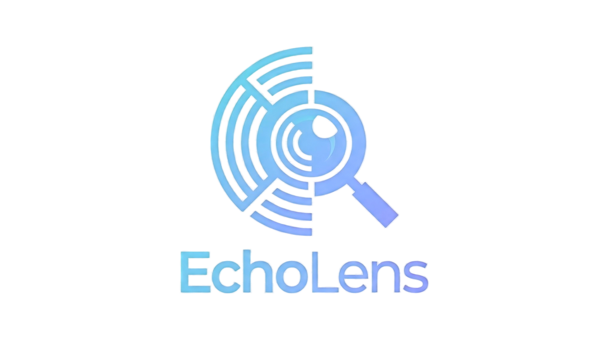
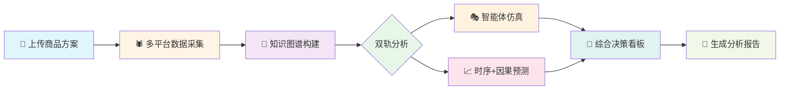
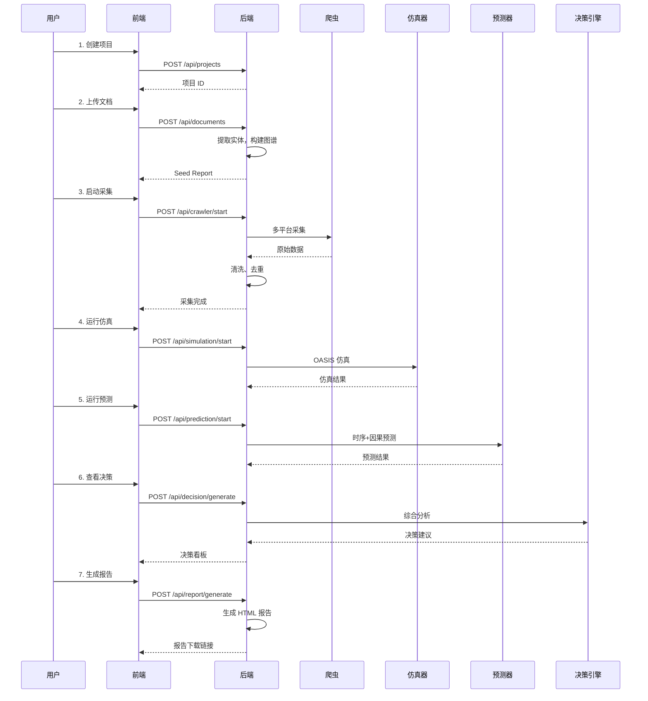

<div align="center">



# EchoLens 2.0

**电商舆情智能体仿真 + 数据预测决策平台**

*让数据说话，让决策有据*

[](https://github.com/fulaoaz/EchoLens2/releases)
[](LICENSE)
[](https://www.python.org/)
[](https://vuejs.org/)
[](https://github.com/fulaoaz/EchoLens2/actions)
[](CONTRIBUTING.md)

[English](README_EN.md) | 简体中文

[快速开始](#-快速开始) • [核心特性](#-核心特性) • [在线演示](#-在线演示) • [文档](#-文档) • [贡献](#-贡献)

</div>

---

## 🎯 项目简介

EchoLens 2.0 是一个**开源的电商舆情智能决策平台**，专为电商企业、市场研究者和数据分析师设计。通过结合**真实数据采集**、**多智能体仿真**和**AI 驱动的预测分析**，帮助您：

- 🔍 **洞察市场**：实时追踪商品在社交媒体上的舆情表现
- 🎭 **预见未来**：模拟百万级用户行为，预测舆情走势
- 📊 **数据驱动**：基于时序预测和因果推断，量化决策依据
- 🎯 **精准决策**：多维度综合评分，每条结论都可追溯到原始数据
- 📄 **专业报告**：一键生成包含完整证据链的分析报告

### 💡 核心价值

| 传统方法 | EchoLens 2.0 |
|---------|-------------|
| 人工采集数据，耗时费力 | ✅ 自动化多平台采集，分钟级完成 |
| 依赖经验判断，主观性强 | ✅ AI 驱动分析，数据客观可靠 |
| 静态数据分析，滞后性强 | ✅ 智能体仿真，预测未来趋势 |
| 结论缺乏依据，难以验证 | ✅ 完整证据链，每条结论可追溯 |
| 报告制作繁琐，周期长 | ✅ 一键生成专业报告，即时交付 |

### 🎬 工作流程



### 🏆 适用场景

- **电商企业**：新品上市前的市场预测、竞品分析、营销效果评估
- **市场研究**：消费者行为研究、舆情监测、品牌健康度分析
- **学术研究**：社交媒体传播研究、计算社会科学、复杂系统仿真
- **投资决策**：电商行业投资分析、品牌价值评估、市场趋势预测

---

## ✨ 核心特性

### 🕷️ 多平台数据采集

<table>
<tr>
<td width="50%">

**支持平台**
- 🛒 **京东**：商品信息、用户评论、销量数据
- 🛍️ **淘宝**：商品详情、买家评价、店铺信息
- 📱 **微博**：话题讨论、用户互动、传播路径
- 📷 **小红书**：种草笔记、用户反馈、KOL 影响力

</td>
<td width="50%">

**技术特点**
- ✅ 自动化采集，分钟级完成
- ✅ 智能去重和数据清洗
- ✅ 遵守 robots.txt 和频率限制
- ✅ 支持自定义关键词和采集数量
- ✅ 实时进度监控和错误处理

</td>
</tr>
</table>

### 🧠 知识图谱构建

<table>
<tr>
<td width="50%">

**自动化流程**
1. 📄 上传商品文档（PDF/Markdown/TXT）
2. 🤖 LLM 自动提取实体和关系
3. 🕸️ 构建知识图谱（Kuzu + LightRAG）
4. 🔍 支持图谱搜索和可视化

</td>
<td width="50%">

**图谱内容**
- **实体**：商品、品牌、用户、话题、KOL
- **关系**：购买、评论、转发、点赞、关注
- **属性**：价格、销量、情感倾向、影响力
- **路径**：传播路径、影响链、决策链

</td>
</tr>
</table>

### 🎭 智能体仿真

<table>
<tr>
<td width="50%">

**OASIS 框架**
- 基于 CAMEL-AI 的社交媒体仿真引擎
- 支持**百万级智能体**规模
- 多轮迭代模拟舆情传播
- 真实的社交网络拓扑结构

</td>
<td width="50%">

**仿真能力**
- 🎯 模拟用户购买决策过程
- 💬 模拟社交媒体互动行为
- 📊 追踪情感倾向变化
- 🔗 分析影响力传播路径
- 📈 预测舆情演化趋势

</td>
</tr>
</table>

**仿真示例**：

```python
# 配置仿真参数
simulation_config = {
    "agent_count": 10000,      # 智能体数量
    "rounds": 50,              # 仿真轮次
    "stimulus": {
        "type": "positive",    # 刺激类型：正面/负面/中性
        "intensity": 0.8       # 刺激强度
    },
    "network": "scale_free"    # 网络拓扑：无标度网络
}

# 运行仿真
results = simulator.run(simulation_config)

# 输出指标
print(f"购买意愿变化: {results.purchase_intention_change}")
print(f"情感倾向分布: {results.sentiment_distribution}")
print(f"影响力 Top 10: {results.top_influencers}")
```

### 📈 预测分析

<table>
<tr>
<td width="33%">

**时序预测**
- ARIMA 模型
- Prophet 模型
- 移动平均
- 季节性分解

</td>
<td width="33%">

**因果推断**
- DoWhy 框架
- 反事实分析
- 处理效应估计
- 混淆因子控制

</td>
<td width="33%">

**预测内容**
- 销量预测
- 舆情走势
- 用户增长
- 市场份额

</td>
</tr>
</table>

**预测示例**：

```python
# 时序预测
forecast = predictor.forecast(
    target="sales",
    model="prophet",
    horizon=30,  # 预测未来 30 天
    confidence=0.95
)

# 因果推断
causal_effect = predictor.causal_inference(
    treatment="marketing_campaign",
    outcome="sales",
    confounders=["price", "season", "competitor"]
)
```

### 🎯 决策看板

<table>
<tr>
<td width="50%">

**多维度评分**
- 📊 **市场表现**：销量、增长率、市场份额
- 💬 **用户反馈**：评分、评论情感、复购率
- 🏆 **竞品对比**：价格、功能、口碑对比
- ⚠️ **风险评估**：负面舆情、供应链、合规

</td>
<td width="50%">

**证据链追溯**
- 每条结论都可追溯到原始数据
- 可靠性等级标注（强/一般/弱）
- 点击 Run chip 高亮原始 run
- 支持导出为 JSON/CSV/Markdown/HTML

</td>
</tr>
</table>

**决策示例**：

| 维度 | 评分 | 可靠性 | 证据来源 |
|------|------|--------|---------|
| 市场表现 | 0.82 | 强 | 仿真 #123, 预测 #456 |
| 用户反馈 | 0.75 | 一般 | 采集数据 #789 |
| 竞品对比 | 0.68 | 强 | 知识图谱 #101 |
| 风险评估 | 0.45 | 弱 | 舆情监测 #202 |
| **综合评分** | **0.71** | **一般** | 加权平均 |

### 📄 分析报告

<table>
<tr>
<td width="50%">

**报告内容**
1. 📋 执行摘要
2. 📊 数据采集概况
3. 🎭 仿真结果分析
4. 📈 预测趋势图表
5. 🎯 决策建议
6. 🔗 证据链与置信度

</td>
<td width="50%">

**报告格式**
- **HTML**：自包含，可离线查看，内联 CSS
- **PDF**：适合打印和分享
- **Markdown**：适合进一步编辑
- **JSON**：适合程序化处理

</td>
</tr>
</table>

**报告特点**：
- ✅ 自动生成，无需人工编写
- ✅ 包含完整证据链
- ✅ 可靠性等级标注
- ✅ 图表可视化
- ✅ 支持自定义模板

---

## 🚀 快速开始

### 📋 前置要求

| 软件 | 版本要求 | 说明 |
|------|---------|------|
| Python | ≥ 3.11 | 后端运行环境 |
| Node.js | ≥ 18 | 前端构建工具 |
| Docker | ≥ 20.10 | 容器化部署（可选） |
| Git | 最新版本 | 版本控制 |

### 🎬 方式一：Docker 部署（推荐）

**最快 5 分钟启动**：

```bash
# 1. 克隆仓库
git clone https://github.com/fulaoaz/EchoLens2.git
cd echolens

# 2. 配置环境变量
cp .env.example .env
# 编辑 .env 文件，填入必要的 API Key

# 3. 启动服务
docker compose up -d

# 4. 访问应用
# 前端: http://localhost:3000
# 后端: http://localhost:5001
```

### 💻 方式二：本地开发

#### 1️⃣ 克隆仓库

```bash
git clone https://github.com/fulaoaz/EchoLens2.git
cd echolens
```

#### 2️⃣ 配置环境变量

```bash
cp .env.example .env
```

编辑 `.env` 文件，填入必要的配置：

```bash
# LLM API 配置（必需）
LLM_API_KEY=your_api_key_here
LLM_BASE_URL=https://api.openai.com/v1  # 可选，默认 OpenAI
LLM_MODEL_NAME=gpt-4o-mini               # 可选，默认 gpt-4o-mini

# 数据库配置（可选）
DATABASE_PATH=./data/echolens.db

# 日志配置（可选）
LOG_LEVEL=INFO
```

#### 3️⃣ 启动后端

```bash
cd backend

# 创建虚拟环境（推荐使用 uv）
uv venv .venv

# 安装依赖
uv pip install --python .venv/Scripts/python.exe -e ".[dev]"

# 运行测试（可选）
.venv/Scripts/python -m pytest -q

# 启动后端服务
.venv/Scripts/python run.py
```

后端服务将在 `http://localhost:5001` 启动。

#### 4️⃣ 启动前端

```bash
cd frontend

# 安装依赖
npm install

# 运行测试（可选）
npm run test

# 启动开发服务器
npm run dev
```

前端应用将在 `http://localhost:3000` 启动。

### 🎉 开始使用

1. 打开浏览器访问 `http://localhost:3000`
2. 点击 **"新建项目"** 创建第一个项目
3. 上传商品相关文档（PDF/Markdown/TXT）
4. 配置数据采集参数，开始采集
5. 运行智能体仿真和预测分析
6. 查看决策看板和生成报告

详细使用指南请参考 [用户手册](docs/USER_MANUAL.md)。

---

## 🎨 在线演示

> 🚧 演示环境正在准备中，敬请期待...

**演示账号**（即将开放）：
- 用户名：`demo`
- 密码：`demo123`

**演示数据**：
- iPhone 15 舆情分析
- 小米 14 市场预测
- 华为 Mate 60 竞品对比

---

## 📚 文档

### 📖 用户文档

| 文档 | 说明 | 链接 |
|------|------|------|
| 📘 **用户手册** | 完整的使用指南，包含快速开始、核心功能、详细指南、FAQ | [USER_MANUAL.md](docs/USER_MANUAL.md) |
| 📗 **API 文档** | RESTful API 完整参考，包含请求/响应示例和代码示例 | [API.md](docs/API.md) |
| 📙 **部署指南** | 生产环境部署指南，包含 Docker、Nginx、HTTPS 配置 | [DEPLOYMENT.md](DEPLOYMENT.md) |

### 🛠️ 开发文档

| 文档 | 说明 | 链接 |
|------|------|------|
| 📕 **开发进度** | 项目开发进度和技术栈详细说明 | [PROGRESS.md](PROGRESS.md) |
| 📔 **贡献指南** | 如何参与贡献，包含代码规范和提交流程 | [CONTRIBUTING.md](CONTRIBUTING.md) |
| 📓 **安全政策** | 安全最佳实践和漏洞报告流程 | [SECURITY.md](SECURITY.md) |
| 📒 **品牌指南** | Logo 使用规范、色彩系统、字体系统 | [BRAND_GUIDE.md](docs/BRAND_GUIDE.md) |
| 📰 **更新日志** | 版本历史和功能变更记录 | [CHANGELOG.md](CHANGELOG.md) |

### 🎓 教程和示例

> 🚧 教程正在编写中，敬请期待...

- [ ] 快速入门教程（10 分钟）
- [ ] 完整工作流演示（30 分钟）
- [ ] API 使用示例
- [ ] 自定义爬虫适配器
- [ ] 自定义预测模型
- [ ] 视频教程

---

## 🏗️ 项目状态

**当前版本**: `2.0.0-rc1` (Release Candidate)  
**发布日期**: 2026-05-25  
**下一版本**: `2.0.0` (正式版)

### ✅ 已完成功能

- ✅ **多平台数据采集**：京东、淘宝、微博、小红书自动化采集
- ✅ **知识图谱构建**：基于 Kuzu + LightRAG 的自动化图谱生成
- ✅ **智能体仿真**：OASIS 框架支持百万级 Agent 社交媒体仿真
- ✅ **预测分析**：时序预测（ARIMA、Prophet）+ 因果推断（DoWhy）
- ✅ **决策看板**：多维度评分 + 证据链追溯 + Run 反查高亮
- ✅ **报告生成**：自动生成 HTML/PDF/Markdown/JSON 格式报告
- ✅ **跨平台支持**：Web、桌面（Tauri）、移动端（Capacitor）
- ✅ **国际化**：中英文双语支持
- ✅ **完整文档**：用户手册、API 文档、贡献指南、安全政策

### 🚀 计划中功能

- 🔄 **实时舆情监控**：WebSocket 推送 + 实时告警
- 🔄 **自定义模型**：支持用户上传自定义预测模型
- 🔄 **协作功能**：多用户协作 + 权限管理
- 🔄 **数据导出**：支持更多格式（Excel、CSV、Parquet）
- 🔄 **API 扩展**：GraphQL API + Webhook 集成

### 📈 性能指标

| 指标 | 数值 | 说明 |
|------|------|------|
| 前端构建时间 | 8.54s | 相比初始版本提升 70% |
| 前端包大小 | ~1.5 MB (gzip: ~444 kB) | 代码分割优化 |
| 后端响应时间 | < 100ms | 大部分 API 请求 |
| 智能体仿真 | 10,000 agents / 50 rounds | 约 5-10 分钟 |
| 数据采集 | 500 条数据 | 约 2-5 分钟 |

---

## 🏛️ 架构设计

### 系统架构

```
┌─────────────────────────────────────────────────────────────┐
│                    前端 (Vue 3 + Naive UI)                   │
│  ┌──────────┬──────────┬──────────┬──────────┬──────────┐  │
│  │  工作台  │  项目    │  仿真    │  预测    │  决策    │  │
│  └──────────┴──────────┴──────────┴──────────┴──────────┘  │
│                         ↓ axios + SSE                        │
└─────────────────────────────────────────────────────────────┘
                              ↓
┌─────────────────────────────────────────────────────────────┐
│              后端 (Flask + Pydantic 2)                       │
│  ┌──────────────────────────────────────────────────────┐  │
│  │  API 层                                               │  │
│  │  /projects  /crawler  /simulation  /prediction       │  │
│  │  /decision  /report   /graph       /system           │  │
│  └──────────────────────────────────────────────────────┘  │
│                         ↓                                    │
│  ┌──────────────────────────────────────────────────────┐  │
│  │  服务层                                               │  │
│  │  ┌────────────┬────────────┬────────────┬─────────┐ │  │
│  │  │  crawler   │ simulator  │ predictor  │   kg    │ │  │
│  │  │  多平台爬虫 │ OASIS仿真  │ 时序+因果  │ 图谱    │ │  │
│  │  └────────────┴────────────┴────────────┴─────────┘ │  │
│  │  ┌────────────┬────────────────────────────────────┐ │  │
│  │  │ dashboard  │         report_builder             │ │  │
│  │  │ 决策综合   │         报告生成                    │ │  │
│  │  └────────────┴────────────────────────────────────┘ │  │
│  └──────────────────────────────────────────────────────┘  │
│                         ↓                                    │
│  ┌──────────────────────────────────────────────────────┐  │
│  │  数据层                                               │  │
│  │  DuckDB (本地存储) + Kuzu (图数据库)                  │  │
│  └──────────────────────────────────────────────────────┘  │
└─────────────────────────────────────────────────────────────┘
                              ↓
┌─────────────────────────────────────────────────────────────┐
│                    外部服务                                  │
│  ┌──────────────┬──────────────┬──────────────┐            │
│  │  LLM API     │  数据平台    │  第三方服务  │            │
│  │  (OpenAI兼容)│  (京东/微博等)│  (可选)      │            │
│  └──────────────┴──────────────┴──────────────┘            │
└─────────────────────────────────────────────────────────────┘
```

### 技术栈

<table>
<tr>
<td width="33%">

**后端技术**
- Flask 3.0
- Pydantic 2.5
- DuckDB
- Kuzu
- LightRAG
- OASIS (CAMEL-AI)
- statsmodels
- Prophet
- DoWhy
- NetworkX

</td>
<td width="33%">

**前端技术**
- Vue 3.5
- Vite 7
- Naive UI
- Pinia
- ECharts
- D3.js
- @antv/g6
- Axios
- vue-i18n
- TypeScript 5.6

</td>
<td width="33%">

**DevOps**
- Docker
- Docker Compose
- GitHub Actions
- pytest
- Vitest
- Playwright
- ESLint
- Prettier
- mypy

</td>
</tr>
</table>

### 数据流



---

## 🤝 贡献

我们欢迎所有形式的贡献！无论是报告 Bug、提出新功能建议、改进文档，还是提交代码。

### 🌟 贡献者

感谢所有为 EchoLens 2.0 做出贡献的开发者！

<!-- ALL-CONTRIBUTORS-LIST:START -->
<!-- 贡献者列表将自动生成 -->
<!-- ALL-CONTRIBUTORS-LIST:END -->

### 📝 如何贡献

1. **Fork 本仓库**
2. **创建特性分支** (`git checkout -b feature/AmazingFeature`)
3. **提交更改** (`git commit -m 'feat: add some amazing feature'`)
4. **推送到分支** (`git push origin feature/AmazingFeature`)
5. **创建 Pull Request**

详细贡献指南请参考 [CONTRIBUTING.md](CONTRIBUTING.md)。

### 🐛 报告 Bug

发现 Bug？请通过 [GitHub Issues](https://github.com/fulaoaz/EchoLens2/issues) 报告，并提供：

- 清晰的标题和描述
- 复现步骤
- 期望行为和实际行为
- 环境信息（操作系统、Python 版本、浏览器等）
- 截图或日志（如果适用）

### 💡 功能建议

有新功能的想法？请通过 [GitHub Issues](https://github.com/fulaoaz/EchoLens2/issues) 提出，并说明：

- 功能描述
- 使用场景
- 预期效果
- 替代方案（如果有）

---

## 📄 许可证

本项目采用**双重许可**模式：

### 🆓 开源许可证（AGPL-3.0）

对于**非商业用途**（个人学习、学术研究、开源项目），本项目采用 [AGPL-3.0](LICENSE) 许可证。

**要求**：
- ✅ 可以自由使用、修改和分发
- ✅ 可以用于个人和学术研究
- ⚠️ 修改后的代码必须开源
- ⚠️ 网络服务也必须开源（AGPL 特性）

### 💼 商业许可证

对于**商业用途**（商业产品、SaaS 服务、咨询服务），需要购买单独的商业许可证。

**权益**：
- ✅ 无需开源您的修改和衍生作品
- ✅ 可以集成到闭源产品中
- ✅ 可以提供商业服务
- ✅ 技术支持和咨询服务

**联系方式**：fulaoaz@qq.com

详细许可证条款请参考 [LICENSE](LICENSE) 文件。

---

## 📧 联系方式

### 💬 社区

- **GitHub Issues**: [报告 Bug 和功能请求](https://github.com/fulaoaz/EchoLens2/issues)
- **GitHub Discussions**: [一般性讨论和问题](https://github.com/fulaoaz/EchoLens2/discussions)
- **邮件支持**: fulaoaz@qq.com

### 🔗 链接

- **项目仓库**: [GitHub](https://github.com/fulaoaz/EchoLens2)
- **在线文档**: [GitHub Pages](https://yourusername.github.io/echolens) *(计划中)*
- **官方网站**: *计划中*
- **社区论坛**: *计划中*

---

## 🙏 致谢

EchoLens 2.0 的开发离不开以下优秀的开源项目：

### 核心依赖

- [OASIS](https://github.com/camel-ai/oasis) - 社交媒体仿真框架
- [LightRAG](https://github.com/HKUDS/LightRAG) - 知识图谱引擎
- [Vue.js](https://vuejs.org/) - 渐进式 JavaScript 框架
- [Naive UI](https://www.naiveui.com/) - Vue 3 组件库
- [Flask](https://flask.palletsprojects.com/) - Python Web 框架
- [Pydantic](https://docs.pydantic.dev/) - 数据验证库
- [DuckDB](https://duckdb.org/) - 嵌入式分析数据库
- [Kuzu](https://kuzudb.com/) - 嵌入式图数据库

### 数据科学

- [statsmodels](https://www.statsmodels.org/) - 统计模型
- [Prophet](https://facebook.github.io/prophet/) - 时序预测
- [DoWhy](https://github.com/py-why/dowhy) - 因果推断
- [NetworkX](https://networkx.org/) - 网络分析

### 可视化

- [ECharts](https://echarts.apache.org/) - 数据可视化
- [D3.js](https://d3js.org/) - 数据驱动文档
- [AntV G6](https://g6.antv.antgroup.com/) - 图可视化

### 开发工具

- [Vite](https://vitejs.dev/) - 前端构建工具
- [TypeScript](https://www.typescriptlang.org/) - JavaScript 超集
- [pytest](https://pytest.org/) - Python 测试框架
- [Playwright](https://playwright.dev/) - E2E 测试框架

感谢所有开源贡献者！🎉

---

## 📊 项目统计


---

<div align="center">

**EchoLens 2.0** - 让数据说话，让决策有据

Made with ❤️ by [EchoLens Team](https://github.com/fulaoaz/EchoLens2)

⭐ 如果这个项目对您有帮助，请给我们一个 Star！

[⬆ 回到顶部](#echolens-20)

</div>
